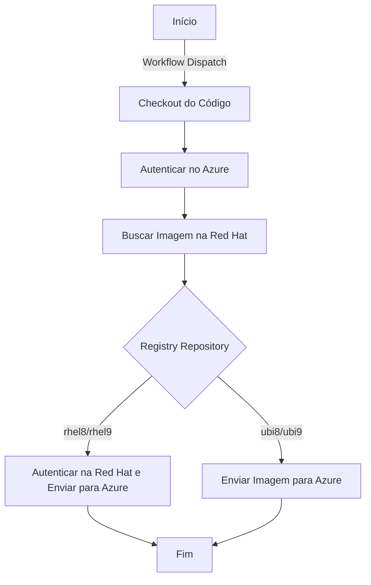

# Sandbox CI/CD Workflow

Este repositório contém um workflow do GitHub Actions para realizar o build e push de imagens Docker em diferentes registries (Red Hat e Azure). O processo pode ser acionado manualmente via `workflow_dispatch`, com opções configuráveis para determinar a imagem e repositório de destino.

## Variáveis de Entrada

O workflow é acionado manualmente e requer os seguintes inputs:

- **`image_tag`**: Tag da imagem Docker a ser utilizada (default: `latest`).
- **`registry_repository`**: Repositório de destino da imagem. Pode ser:
  - `ubi9`
  - `ubi8`
  - `rhel8`
  - `rhel9`
- **`image_repository`**: Nome da imagem base (exemplo: `nginx-120`).

## Etapas do Workflow

### 1. Checkout do Código

Obtém o código do repositório.

```yaml
- name: Checkout do código
  uses: actions/checkout@v4
```

### 2. Autenticação no Azure

Faz login no Azure para acessar o container registry.

```yaml
- name: Autenticar no Azure
  uses: azure/login@v1
  with:
    creds: ${{ secrets.AZURE_CREDENTIALS }}
```

### 3. Busca da Imagem na Registry Red Hat

Busca informações da imagem na Red Hat e extrai a última tag disponível.

```yaml
- name: Busca da imagem na Registry Red Hat
  id: busca_imagem
  run: |
    # Código para buscar a imagem e tag mais recente
```

### 4. Autenticação no Azure Container Registry

Faz login no registry do Azure para poder enviar imagens Docker.

```yaml
- name: Autenticar Registry Azure
  uses: azure/docker-login@v2
  with:
    login-server: ${{ vars.REGISTRY_AZURE }}
    username: ${{ secrets.DOCKERIO_USERNAME }}
    password: ${{ secrets.DOCKERIO_PASSWORD }}
```

### 5. Autenticação na Registry Red Hat

Se o `registry_repository` for `rhel8` ou `rhel9`, o workflow autentica na Red Hat e faz o pull da imagem.

```yaml
- name: Autenticar Registry Redhat.io 
  id: registry_redhat_io
  if: ${{ github.event.inputs.registry_repository == 'rhel8' || github.event.inputs.registry_repository == 'rhel9' }}
  run: |
    docker login "${{ vars.REGISTRY_IO }}" -u "${{ secrets.REDHAT_IO_USERNAME }}" --password-stdin
    docker pull ${{ vars.REGISTRY_REDHAT_IO }}/$img_find:$tag_latest 
    docker tag ${{ vars.REGISTRY_REDHAT_IO }}/$img_find:$tag_latest registryimage.azurecr.io/$img_find:$tag_latest
    docker push registryimage.azurecr.io/$img_find:$tag_latest
```

### 6. Envio da Imagem para o Azure Container Registry

Se o `registry_repository` for `ubi8` ou `ubi9`, a imagem é enviada para o Azure.

```yaml
- name: Enviando imagem Azure registry
  if: ${{ github.event.inputs.registry_repository == 'ubi9' || github.event.inputs.registry_repository == 'ubi8' }}
  run: |
    docker pull ${{ vars.REGISTRY_REDHAT }}/$img_find:$tag_latest          
    docker tag ${{ vars.REGISTRY_REDHAT }}/$img_find:$tag_latest registryimage.azurecr.io/$img_find:$tag_latest
    docker push registryimage.azurecr.io/$img_find:$tag_latest
```

## Diagrama do Fluxo



## Conclusão

Este workflow automatiza o processo de obtenção e envio de imagens Docker da Red Hat para o Azure Container Registry, garantindo flexibilidade na escolha da imagem e do repositório de destino. Caso precise de mais ajustes ou melhorias, sinta-se à vontade para contribuir!